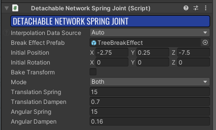
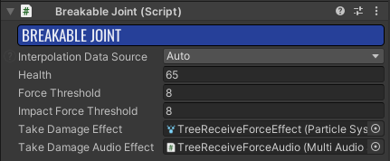
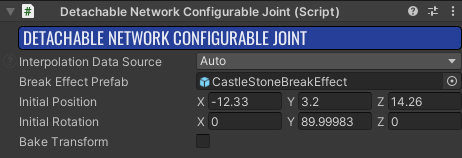
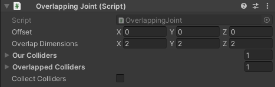

# Joints

Davigo uses many types of joints to keep pullable objects in place. For instance, the Blockwall prefab uses an `Overlapping Joint`, whereas the Tree prefab uses the `Detachable Network Spring Joint`. Both of these joints will keep your rigidbody in place, with varying methods. This may seem confusing at first, but be assured; with enough practice, you'll be a joint-making pro!

## Spring Joints

Spring Joints will cause your objects to stay in place and wiggle when force is applied to them, like the default tree prefab. All rigidbodies with spring joints need at least 2 components to fully work the way you'd expect them to, these being the `Detachable Network Spring Joint`(DNSJ), and the `Breakable Joint`(BJ) components respectively. If this is your first time making a rigidbody with a spring joint, I recommend setting the DNSJ's variables to what the Tree prefab uses.

Now, that's great and all, but what the heck do any of these variables mean?! Well, in order from top to bottom of each component:

### Detachable Network Spring Joint

 - **Interpolation Data Source:** I honestly have no idea; unless you feel like experimenting, don't touchie.
 - **Break Effect Prefab:** This is the particle system that'll play when the spring joint finally breaks. It's a good idea to make this flashy to make it clear when it has broken.
 - **Initial Position / Rotation:** also no clue. if you find someone that actually knows about this, please update this.
 - **Bake Transform:** uh yeah no clue; yell at squirrel to explain it to you or something.
 - **Mode:** This setting has 3 options. By default, it's set to `Transform`
 - **Mode `Transform`:** This will cause your rigidbody to only spring back into place once it has been moved. This will not apply to rotation with this setting enabled.
 - **Mode `Rotation`:** Like `Transform`, this will cause your rigidbody to only spring back into place when it is rotated. However, this will cause your rigidbody to not stay in place, due to it only affecting rotation in this setting.
 - **Mode: `Both`:** This will cause your rigidbody to spring back into place when it is either moved or rotated. This will give your rigidbody the spring-y effect that the tree prefab has by default. This will also allow your rigidbody to stay in place.
 - **Translation / Angular Sping:** These settings affect how much force a rigidbody will use to go back to its original position or rotation, respectively. Make sure not to set the value too high, however, as your rigidbody will go shooting off into oblivion, rendering it useless.
 - **Translation / Angular Dampen:** This is the modifier applied to your rigidbody's tramslation / angular force. A high value will perserve less force, causing your rigidbody to wiggle less, whereas a lower value will let your object spring around to its heart's desire. It's recommended to keep these values between 0.1 - 0.9.

### Breakable Joint

 - **Interpolation Data Source:** once again, no clue. leave it on auto unless you like headaches.
 - **Health:** This is how long it will take to pull your object out. A good range value range for spring joints is 50 - 80 health.
 - **Force / Impact Force Threshold:** These values dictate how much force your object can receive without breaking. A value around 8 usually works for most gameplay scenarios.
 - **Take Damage Effect:** This is the particle effect that will play when the joint takes damage. It's a good idea to make this effect cheap and easy to render, due to how frequently it'll be played in normal gameplay.
 - **Take Damage Audio Effect:** Similar to the damage effect, this sound will play when the joint takes damage. Davigo likes to freak out if you parenet your audio to the main object. Instead, have the interpolation target be the parent.

## Overlapping Joints

Overlapping joints keep your object in place until they are pulled out from where they happen to be. These, for whatever reason, need 3 components, as opposed to the spring joint's simplier 2. The required componets include the `Overlapping Joint` (OJ), `Detachable Network Configurable Joint` (DNCJ), and the `Breakable Joint` (BJ). As the breakable joint has already been covered, it will not be referenced in this section.

### Detachable Network Configurable Joint

 - **Interpolation Data Source:** As with the spring joint, this is a mystery to me. Leave it on `Auto` unless you know what you're doing.
 - **Break Effect Prefab:** This is the effect that will play when the DNCJ finally breaks. It is recommended that this effect is flashy, so that it is obvious when the object is released.
 - **Inital Position / Rotation:** These settings control... something. If you desperately need to know what these control, I recommend playing with them in a testing map. Leave everything at 0 if you don't know what you're doing.
 - **Bake Transform:** This setting also eludes me. To be honest, you don't need to change any of these setttings to make a functioning pullable object.

### Overlapping Joint

 - **Offset:** This controls the where the center of your overlap dementions are. 0,0,0 is the origin of your object.
 - **Overlap Dimentions:** These settings dictate the shape of your overlap. A good rule of thumb is to make this box completely cover your object. Be aware; this box does not scale in a linear fashion, resulting in an overlap that is way bigger or way smaller than the actual object at different object scales. It's recommended to manually change the overlap to be bigger after scaling.
 - **Our Colliders:** A place for you to put of all of your rigidbody's colliders. No clue if this makes a difference on how the overlapping joint functions, but I've left this setting empty this entire time without issue, so maybe just leave it be?
 - **Overlapping Colliders:** A list of colliders touching your rigidbody. No clue how this affects your object, but it's here if you want it.
 - **Collect Colliders:** A handy-dany button that automatically collects your rigidbody's colliders and figures out what's overlapping your object. Perfect for people who are lazy... like me!
